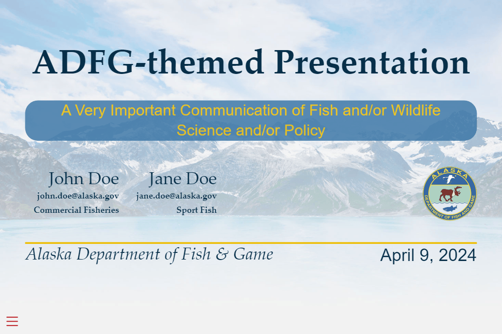

# SoA-theme

This repository contains a theme and template for making Alaska Department of Fish \& Game
(ADF\&G) styled presentations slides
using Quarto Reveal.js. This theme has the same `.css` attributes which style 
State of Alaska websites and loosely complies with State of Alaska
[look and feel standards](https://webcontent.alaska.gov/style/soa/20170315/pdf/Look-Feel-Policy-2016-v1.0.5.pdf).
A preview of the theme is shown below.




## Installation and usage

To install and use the theme, navigate to your projects root directory and 
execute the following shell command:

```bash
quarto install extension cl-roberts/ADFG-theme
```

This will create an `_extensions` subdirectory in your local file system which
contains this theme and any other quarto extension you may download. Then to use
the theme in a Reveal.js presentation simply add the following lines to your
`.qmd` file's YAML:

```yaml
format:
  ADFG-theme-revealjs: default 
```

Alternatively, the following shell command

```bash
quarto use template cl-roberts/ADFG-theme
```

will install the extension and create a template qmd file that you can use as a 
starting place for your presentation.

## Customization

If this theme does not meet your needs, I recommend customizing the `css` code
contained in `_extensions\ADFG-theme\ADFG-theme.scss`

## Restrictions on using the ADF\&G logo

Use of the ADF&G logo is reserved for official publications, electronic or paper. 
Restrictions on use of the ADF&G logo are based on our copyright protection of 
an original work of authorship as derived from (Alaska Statutes) AS 16.05.050(2), 
16.05.050(8), and AS 44.99.400.

## Example

Here is the source code for the template slide show: [template.qmd](template.qmd).
